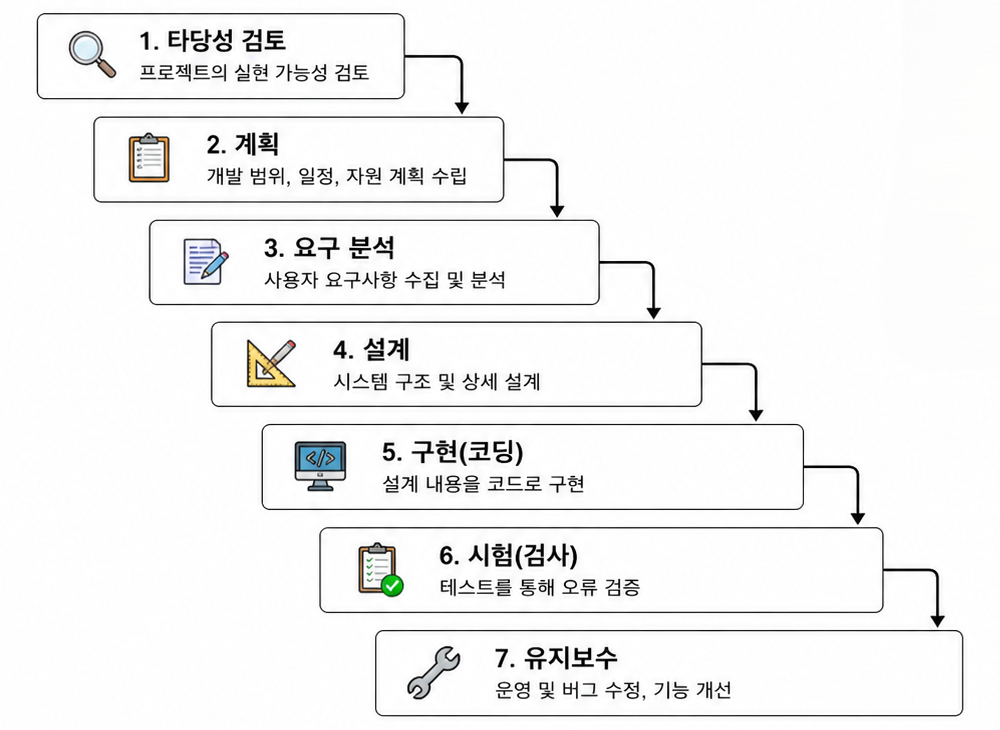
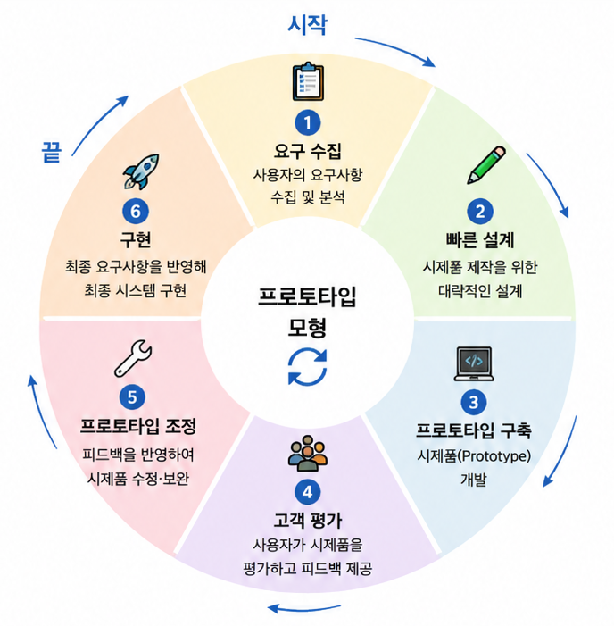
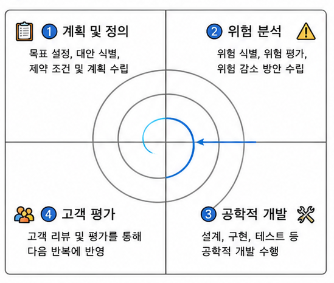
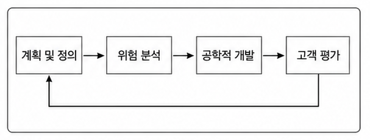
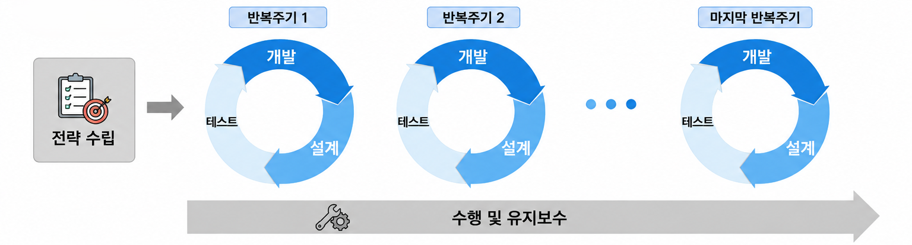
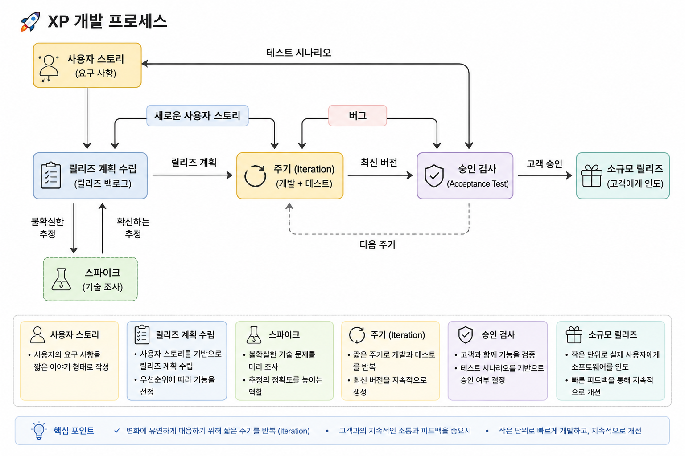
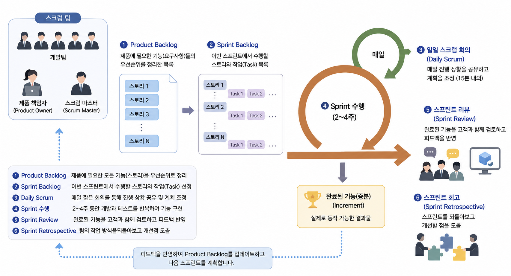

# 💻 01. 소프트웨어 개발 방법론

## 🌱 소프트웨어 생명주기 ( Software Life Cycle )

### 📖 개요

소프트웨어를 **기획부터 개발, 운영, 유지보수까지** 수행하기 위한 전 과정을 단계별로 정의한 것이다.

 

#### ✨ 특징

- 소프트웨어 개발 단계와 각 단계의 주요 활동 및 산출물을 정의한다.
- 소프트웨어 개발 방법론의 기반이 된다.
- 프로젝트의 특성과 개발 환경에 따라 적절한 생명주기 모형을 선택하여 적용한다.

 

> **소프트웨어 생명주기 모형 ( SDLC Model )**  
> 소프트웨어 생명주기를 표현한 개발 프로세스 모델
>
> - Software Process Model
> - Software Engineering Paradigm

  

  

## 🏗️ 소프트웨어 공학 ( Software Engineering )

### 📖 정의

소프트웨어의 **위기 ( Software Crisis )** 를 해결하기 위해 등장한 학문으로,

다양한 **개발 방법론**, **도구**, **관리 기법**을 이용하여 소프트웨어의 **품질**과 **생산성**을 향상시키는 것을 목표로 한다.

 

### 📚 대표적인 정의

- IEEE의 소프트웨어 공학 표준 용어사전
- Fairley
- Boehm

> 💡 시험에서는 정의를 제시한 사람 ( 기관 ) 을 묻는 문제가 출제될 수 있다.

 

### 📌 기본 원칙

✅ 현대적인 프로그래밍 기술을 지속적으로 적용한다.  
✅ 개발된 소프트웨어의 품질을 지속적으로 검증한다.  
✅ 개발 과정과 결과를 체계적으로 기록하고 관리한다.

  

  

## 🔄 소프트웨어 생명주기 모형

 

### 🌊 1. 폭포수 모형 ( Waterfall Model )

#### 📖 정의

각 개발 단계를 **순차적으로 수행**하며, **이전 단계로 돌아가지 않는 것**을 전제로 하는 개발 모형이다.

 

##### ✨ 특징

- 전통적인 소프트웨어 생명주기 모형 ( 고전적 생명주기 모형 )
- 각 단계가 완료되어야 다음 단계로 진행 가능
- 단계별 산출물이 명확하다.
- 단계가 끝날 때마다 결과를 검토하고 승인한다.
- 개발 과정이 문서 중심으로 이루어진다.
- 두 개 이상의 단계가 동시에 수행되지 않는다.

 

#### 📷 개발 과정

  

### 🧪 2. 프로토타입 모형 ( Prototype Model )

#### 📖 정의

사용자의 요구사항을 정확하게 파악하기 위해 **시제품 ( Prototype )** 을 먼저 제작한 후, 이를 수정·보완하면서 최종 시스템을 개발하는 모형이다.

 

##### ✨ 특징

- 시제품 ( Prototype ) 을 통해 요구사항을 명확하게 파악할 수 있다.
- 사용자와 개발자의 의사소통이 원활하다.
- 새로운 요구사항이 발생하면 프로토타입에 반영하여 반복적으로 개선한다.
- 구현 단계에서 사용할 골격 코드를 제공할 수 있다.
- 단기간 제작을 목적으로 하므로 비효율적인 알고리즘이나 코드가 사용될 수 있다.

 

#### 📷 개발 과정

  

### 🌀 3. 나선형 모형 ( Spiral Model )

#### 📖 정의

**폭포수 모형**과 **프로토타입 모형**의 장점을 결합하고, **위험 분석 ( Risk Analysis )** 을 추가한 개발 모형이다.

> **Boehm ( 보헴 )**이 제안하였다.

 

##### ✨ 특징

- 위험 분석을 중심으로 개발을 진행한다.
- 개발 과정을 반복하면서 점진적으로 완성도를 높인다.
- 요구사항 변경에 유연하게 대응할 수 있다.
- 대규모 프로젝트나 위험 요소가 많은 프로젝트에 적합하다.
- 핵심 기술의 불확실성이 큰 프로젝트에 적합하다.

 

#### 📷 개발 과정

 

#### 📷 개발 흐름

  

### ⚡ 4. 애자일 모형 ( Agile Model )

⭐ **애자일은 소프트웨어 생명주기 모형으로도 분류되고, 동시에 하나의 개발 철학( 방법론 )으로도 사용**

 

#### 📖 정의

**애자일( Agile )**은 '민첩한', '기민한'이라는 의미로,

고객의 요구사항 변화에 **유연하게 대응**하기 위해 **짧은 개발 주기**를 반복하며 소프트웨어를 개발하는 방법론이다.

 

##### ✨ 특징

- 고객과의 지속적인 소통을 중시한다.
- 일정한 개발 주기 ( 반복 ) 를 통해 기능을 점진적으로 완성한다.
- 요구사항 변경에 유연하게 대응할 수 있다.
- 고객의 요구사항에 우선순위를 부여하여 개발한다.
- 동작하는 소프트웨어를 빠르게 제공하는 것을 목표로 한다.
- 소규모 프로젝트나 변화가 잦은 프로젝트에 적합하다.

> 💡 **Sprint ( 스프린트 )** 또는 **Iteration ( 이터레이션 )** 이라 불리는 짧은 개발 주기를 반복한다.

 

#### 🚀 등장 배경

##### 📱 소프트웨어 개발 환경의 변화

- 모바일 중심의 개발 환경으로 변화
- 빠른 출시 ( Time-to-Market ) 와 잦은 배포의 중요성 증가

##### 📄 기존 개발 방법론의 한계

- 문서와 절차 중심의 개발 방식
- 요구사항 변경에 신속하게 대응하기 어려움

➡️ 변화에 빠르게 대응할 수 있는 개발 방법론의 필요성이 증가하였다.

 

#### 📷 개발 과정

> 전략 수립 → 반복주기( 설계 → 개발 → 테스트 ) → 반복주기 → … → 최종 완료 및 유지보수

 

#### 📜 애자일 선언 ( Agile Manifesto )

##### ✅ 4가지 핵심 가치

> 📝 암기: ***개변동고***
>
> **개**인과 상호작용  
> **변**화에 대응  
> **동**작하는 소프트웨어  
> **고**객과의 협력

 

| 기존 방식보다 더 중요하게 생각하는 것 |
|--------------------------------------|
| 👥 공정과 도구보다 **개인과 상호작용** |
| 📑 포괄적인 문서보다 **동작하는 소프트웨어** |
| 🤝 계약 협상보다 **고객과의 협력** |
| 🔄 계획을 따르기보다 **변화에 대응** |

 

### 📌 애자일 개발 12가지 실행 지침

애자일 선언을 실제 개발에 적용하기 위한 **12가지 실행 원칙**이다.

> 💡 정보처리기사에서는 **애자일 선언( 4가지 핵심 가치 )**를 우선적으로 학습하고, 12가지 실행 지침은 존재와 목적 정도만 알아두면 충분하다.

  

  

## 📌 애자일 방법론 유형
애자일을 기반으로 하는 대표적인 개발 방법론

### 🚀 XP ( eXtreme Programming )

#### 📖 정의

**XP( eXtreme Programming )**는 고객의 요구사항 변화에 **유연하게 대응**하기 위해 고객의 적극적인 참여와 **짧고 반복적인 개발( Iteration )**을 통해 소프트웨어를 빠르게 개발하는 애자일 개발 방법론이다.

##### ✨ 특징

- 짧고 반복적인 개발 주기를 통해 소프트웨어를 빠르게 개발한다.
- 고객이 개발 과정에 적극적으로 참여한다.
- 단순한 설계를 지향하여 개발 생산성을 향상시킨다.
- 릴리즈 주기를 짧게 반복하여 요구사항 변경에 신속하게 대응한다.
- 릴리즈마다 고객이 직접 테스트하여 요구사항 반영 여부를 확인한다.
- 비교적 **소규모 개발 프로젝트**에 적합하다.

> 💡 **XP의 핵심은 고객 참여와 반복 개발이다.**

 

#### ❤️ XP의 5가지 핵심 가치

> 📝 암기 : ***용단의 피존***
>
> **용**기 ( Courage )  
> **단**순성 ( Simplicity )  
> **의**사소통 ( Communication )  
> **피**드백 ( Feedback )  
> **존**중 ( Respect )

 

| 핵심 가치 | 설명 |
|-----------|------|
| 💪 용기 ( Courage ) | 변화에 적극적으로 대응하고 필요한 경우 과감하게 개선한다. |
| ✨ 단순성 ( Simplicity ) | 현재 필요한 기능만 단순하게 구현한다. |
| 💬 의사소통 ( Communication ) | 고객과 개발자, 개발자 간의 원활한 의사소통을 중요하게 생각한다. |
| 🔄 피드백 ( Feedback ) | 지속적인 테스트와 고객 피드백을 통해 품질을 향상시킨다. |
| 🤝 존중 ( Respect ) | 팀원 간의 상호 존중을 바탕으로 협업한다. |

 

#### 🔄 XP 개발 프로세스

 

###### 📌 사용자 스토리 ( User Story )

고객의 요구사항을 **기능 중심의 간단한 시나리오**로 작성한 것이다.

- 기능 단위로 작성한다.
- 필요한 경우 간단한 테스트 항목( Test Case )을 함께 작성한다.

 

###### 📌 릴리즈 계획 수립 ( Release Planning )

사용자 스토리를 바탕으로 **릴리즈 일정과 개발 범위**를 계획한다.

> 💡 **릴리즈( Release )** : 일부 기능이 완성된 소프트웨어를 고객에게 제공하는 것

 

###### 📌 스파이크 ( Spike )

기술적인 문제나 위험 요소를 사전에 검증하기 위해 작성하는 **간단한 프로그램**이다.

- 기술적 위험을 줄이기 위한 목적으로 작성한다.
- 검증하려는 기능 외의 요소는 최소화한다.

 

###### 📌 이터레이션 ( Iteration )

릴리즈를 구성하는 **짧은 반복 개발 주기**이다.

- 하나의 릴리즈는 여러 개의 이터레이션으로 구성된다.
- 개발 도중 새로운 요구사항이 발생하면 현재 또는 다음 이터레이션에 반영한다.

 

###### 📌 승인 테스트 ( Acceptance Test )

고객이 직접 수행하는 테스트이다.

- 구현된 기능이 요구사항을 만족하는지 확인한다.
- 사용자 스토리 작성 시 정의한 테스트 항목을 기준으로 수행한다.
- 발견된 오류나 변경 사항은 다음 이터레이션에 반영한다.

 

###### 📌 소규모 릴리즈 ( Small Release )

개발된 기능을 **짧은 주기로 고객에게 제공**하는 과정이다.

- 고객의 피드백을 빠르게 받을 수 있다.
- 요구사항 변경에 유연하게 대응할 수 있다.
- 릴리즈가 최종 결과물이 아니라면 다음 릴리즈를 계속 진행한다.

 

#### 📚 XP의 12가지 기본 원리

| 기본 원리 | 설명 |
|-----------|------|
| 👥 Pair Programming | 두 명의 개발자가 하나의 작업을 함께 수행 |
| 🤝 Collective Ownership | 모든 개발자가 모든 코드를 수정 가능 |
| 🔄 Continuous Integration | 변경된 코드를 지속적으로 통합 |
| 📅 Planning Process | 고객과 함께 개발 계획 수립 |
| 🚀 Small Releases | 작은 단위로 자주 릴리즈 |
| 💭 Metaphor | 공통된 비유를 사용하여 시스템 이해 |
| ✨ Simple Design | 현재 필요한 기능만 단순하게 설계 |
| 🧪 Test-Driven Development ( TDD ) | 테스트를 먼저 작성한 후 개발 |
| ♻️ Refactoring | 기능 변화 없이 내부 구조 개선 |
| ⏰ 40-Hour Week | 무리한 야근을 지양하는 개발 문화 |
| 🙋 On-Site Customer | 고객이 개발팀과 함께 참여 |
| 📖 Code Standard | 코딩 규칙을 통일하여 유지보수성 향상 |

  

### 🏉 Scrum ( 스크럼 )

#### 📖 정의

**스크럼(Scrum)**은 애자일 개발 방법론 중 하나로, **팀 중심의 협업**과 **반복적인 개발(Sprint)**을 통해 개발 효율성과 생산성을 높이는 개발 방법론이다.

> 💡 **Scrum**은 럭비의 *스크럼(Scrum)*에서 유래한 용어로, 팀원들이 협력하여 목표를 달성한다는 의미를 담고 있다.

##### ✨ 특징

- 팀원 스스로 역할을 분담하고 문제를 해결하는 **자율 조직(Self-Organizing Team)**을 지향한다.
- 다양한 직군이 함께 협업하는 **Cross-Functional Team**으로 구성된다.
- 짧은 개발 주기(Sprint)를 반복하며 기능을 점진적으로 완성한다.
- 고객의 요구사항 변화에 유연하게 대응할 수 있다.

 

#### 👥 스크럼 팀 구성

##### 👤 제품 책임자 (Product Owner)

제품의 요구사항과 우선순위를 관리하는 책임자이다.

**주요 역할**

- 이해관계자의 의견을 종합하여 요구사항(User Story)을 작성
- 제품 백로그(Product Backlog) 관리
- 백로그 우선순위 결정
- 개발된 기능을 검토하고 요구사항을 지속적으로 갱신

> 💡 **백로그의 우선순위를 결정할 수 있는 사람은 Product Owner이다.**

 

##### 🧑‍💼 스크럼 마스터 (Scrum Master)

스크럼이 올바르게 수행될 수 있도록 지원하는 **가이드(촉진자)** 역할을 담당한다.

**주요 역할**

- 스크럼 프로세스 관리
- 개발 과정에서 발생한 장애 요소 해결 지원
- 일일 스크럼 회의(Daily Scrum) 진행
- 팀이 스크럼 원칙을 준수하도록 지원

> 💡 **프로젝트 관리자가 아니라 팀을 지원하는 역할**이라는 점을 기억하자.

 

##### 👨‍💻 개발팀 (Development Team)

실제 제품을 개발하는 팀이다.

- 개발자, 디자이너, 테스터 등 다양한 직군으로 구성
- 보통 **5~9명 정도**의 소규모 팀으로 운영
- 스스로 업무를 계획하고 수행한다.

 

#### 📷 스크럼 개발 프로세스

 

##### 📌 주요 개발 절차

###### 📚 Product Backlog ( 제품 백로그 )

제품 개발에 필요한 모든 요구사항(User Story)을 우선순위에 따라 정리한 목록이다.

- 지속적으로 업데이트된다.
- 릴리즈 계획의 기준이 된다.

 

###### 📅 Sprint Planning ( 스프린트 계획 회의 )

이번 스프린트에서 수행할 작업을 선정하는 회의이다.

- Product Backlog에서 작업 선택
- 작업(Task)으로 분할
- Sprint Backlog 작성

 

###### 📋 Sprint Backlog ( 스프린트 백로그 )

이번 스프린트에서 수행할 작업(Task) 목록이다.

 

###### 🔄 Sprint ( 스프린트 )

실제 개발이 이루어지는 반복 개발 기간이다.

- 보통 **2~4주**
- 개발 → 테스트 → 기능 완성

 

###### ☀️ Daily Scrum ( 일일 스크럼 회의 )

매일 약 **15분 동안** 진행하는 짧은 회의이다.

- 진행 상황 공유
- 오늘 할 일(To Do) 확인
- 장애 요소 공유

> 💡 보통 **서서 진행(Stand-up Meeting)** 한다.

 

###### 📈 Burn-down Chart ( 번 다운 차트 )

남은 작업량을 시간에 따라 표현한 그래프이다.

- X축 : 시간
- Y축 : 남은 작업량

 

###### ✅ Sprint Review ( 스프린트 검토 회의 )

스프린트에서 완성된 기능을 고객과 함께 검토하는 회의이다.

- 기능 시연
- 고객 피드백 수집
- Product Backlog 갱신

 

###### 🔍 Sprint Retrospective ( 스프린트 회고 )

스프린트 종료 후 팀이 수행 과정을 돌아보며 개선점을 찾는 회의이다.

- 잘한 점
- 부족한 점
- 다음 스프린트 개선 사항

 

###### ⚡ Velocity ( 속도 )

한 번의 스프린트 동안 팀이 수행 가능한 작업량을 나타내는 지표이다.

  

### 🏭 Lean ( 린 )

#### 📖 정의

**린(Lean)**은 **도요타 생산 방식(TPS)**을 소프트웨어 개발에 적용한 애자일 개발 방법론으로, **낭비(Waste)를 제거**하여 품질과 생산성을 향상시키는 것을 목표로 한다.

##### ✨ 특징

- 불필요한 작업(낭비) 제거
- 빠른 가치 제공
- 지속적인 개선(Continuous Improvement)
- **JIT(Just In Time)** 적용
- **Kanban Board**를 활용한 작업 시각화

> 💡 **Lean = 낭비 제거 + Kanban Board**

  

### 💎 Crystal ( 크리스탈 )

#### 📖 정의

**크리스탈(Crystal)**은 **프로세스나 도구보다 사람과 의사소통을 중시**하는 애자일 개발 방법론이다.

##### ✨ 특징

- 사람 중심 개발
- 팀 규모에 따라 다양한 Crystal 방법론 제공
- 프로젝트 규모와 중요도에 따라 적용 방법이 달라짐
- 소규모 프로젝트에 적합

> 💡 **Crystal = 사람 중심(Person-Oriented)**

  

### 🌐 ASD ( Adaptive Software Development )

#### 📖 정의

**ASD**는 변화와 불확실성을 전제로 하여 지속적으로 적응하며 개발하는 애자일 방법론이다.

> 💡 최근 정보처리기사에서는 출제 빈도가 낮다.

  

### 🧩 FDD ( Feature Driven Development : 기능 중심 개발 )

#### 📖 정의

**FDD**는 기능( Feature ) 단위로 개발을 수행하여 빠른 피드백과 지속적인 개선을 추구하는 애자일 개발 방법론이다.

##### ✨ 특징

- 기능 중심 개발
- 짧은 개발 주기
- 반복적인 기능 제공

> 💡 최근 정보처리기사에서는 출제 빈도가 낮다.

  

  

## 📝 소프트웨어 개발 방법론 핵심 정리

| 구분 | 핵심 키워드 |
|---|---|
| 소프트웨어 생명주기 | 소프트웨어 개발부터 유지보수까지의 전체 과정 |
| 폭포수 모형 | 순차적 개발, 단계별 산출물 명확 |
| 프로토타입 모형 | 시제품 제작, 요구사항 개선 |
| 나선형 모형 | 위험 분석, 반복 개발 |
| 애자일 모형 | 고객 요구사항 변화에 유연하게 대응 |
| XP | 고객 참여, 반복 개발, TDD, Pair Programming |
| Scrum | Sprint, Product Backlog, Scrum Master |
| Lean | 낭비 제거, JIT, Kanban |
| Crystal | 사람 중심, 의사소통 중시 |
| ASD | 변화와 불확실성에 적응 |
| FDD | 기능 중심 개발 |