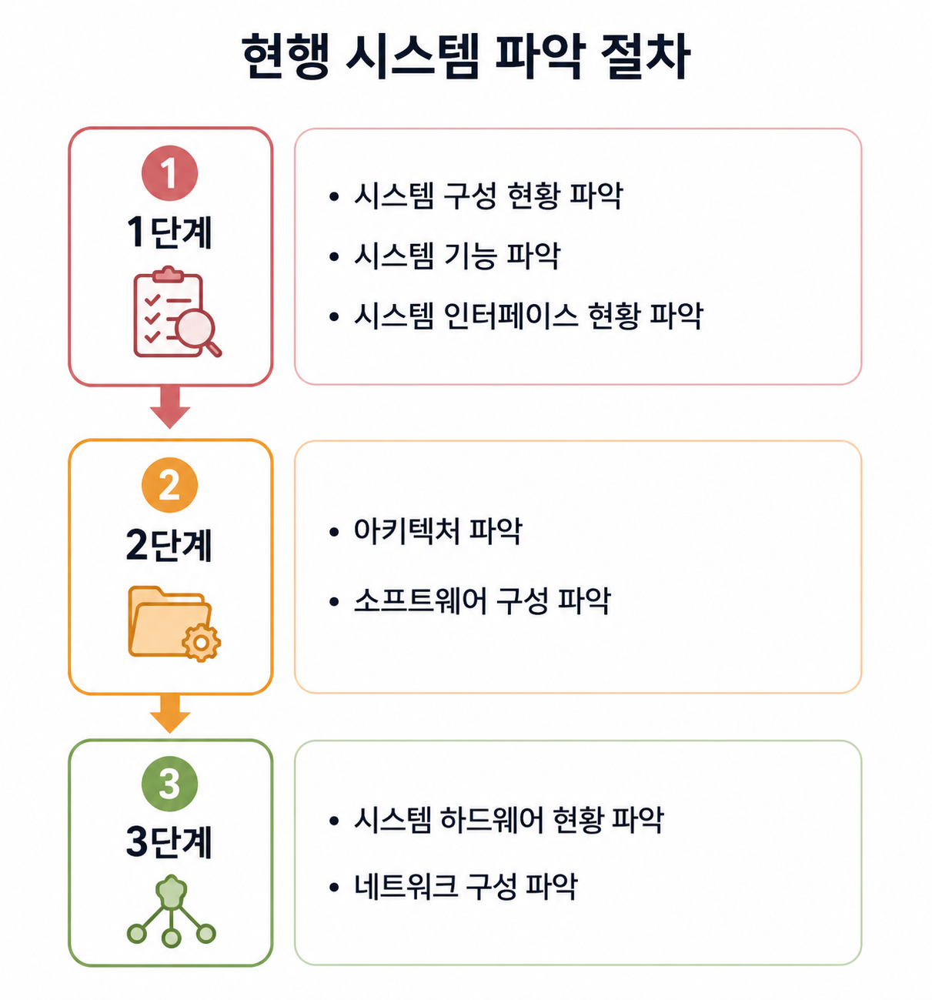

# 💻 02. 현행 시스템 분석

## 📖 개요

현행 시스템 분석은 **새로운 시스템을 개발하기 전에 기존 시스템의 구성과 기술 환경을 분석하여 개발 범위를 명확하게 설정하는 과정**이다.

기존 시스템의 구조와 기능을 이해하고, 시스템 간 연계 방식과 기술적 제약 사항을 파악하여 안정적인 시스템을 구축하기 위한 기초 단계이다.

#### 🎯 목적

- 개발 범위를 명확하게 설정한다.
- 기존 시스템의 구조와 기능을 이해한다.
- 시스템 간 연계 방식을 파악한다.
- 개발에 필요한 기술 환경을 분석한다.
- 중복 개발을 방지하고 유지보수성을 향상시킨다.

  

  

## 🔍 현행 시스템 분석 절차

현행 시스템은 다음과 같은 절차로 분석한다.

📷 **현행 시스템 분석 절차**

> 시스템 구성 → 시스템 기능 → 시스템 인터페이스 → 시스템 아키텍처 → 소프트웨어 → 하드웨어 → 네트워크 순으로 분석한다.

  

  

## 🏗️ 현행 시스템 구성 요소

현행 시스템 분석에서는 시스템을 구성하는 다양한 요소를 분석한다.

 

### 📦 시스템 구성

#### 📖 정의

조직에서 운영 중인 전체 정보 시스템의 구성을 파악하는 과정이다.

#### ✨ 특징

- 기간 업무와 지원 업무로 구분하여 작성한다.
- 단위 업무 시스템의 명칭과 주요 기능을 기술한다.
- 조직 전체 정보 시스템의 현황을 파악할 수 있다.

 

### ⚙️ 시스템 기능

#### 📖 정의

단위 업무 시스템이 현재 제공하는 기능을 분석하는 과정이다.

#### ✨ 특징

- 주요 기능
- 하위 기능
- 세부 기능

순으로 **계층 구조 ( Hierarchy )** 로 표현한다.

 

### 🔄 시스템 인터페이스

#### 📖 정의

단위 업무 시스템 간 데이터를 주고받는 방식을 분석하는 과정이다.

#### ✨ 분석 항목

- 데이터 종류
- 데이터 형식
- 프로토콜 ( Protocol )
- 연계 유형
- 연계 주기

> 💡 어떤 데이터를 어떤 형식으로 어떤 통신 규약을 이용하여 주고받는지 파악하는 것이 핵심이다.

 

### 🏛️ 시스템 아키텍처

#### 📖 정의

시스템 내부의 구성 요소들이 어떤 관계로 상호작용하는지를 계층 구조로 표현한 것이다.

#### ✨ 특징

- 기간 업무 수행에 사용되는 기술 요소를 계층별로 표현한다.
- 아키텍처 구성도를 작성하여 시스템 구조를 파악한다.
- 단위 업무 시스템별 아키텍처가 다른 경우 핵심 기간 업무 시스템을 기준으로 작성한다.

> 💡 **시스템 아키텍처 ( System Architecture )** 는 시스템의 구성과 동작 원리를 표현한 구조를 의미한다.

 

### 💿 소프트웨어 구성

#### 📖 정의

단위 업무 시스템에서 사용하는 소프트웨어 정보를 분석하는 과정이다.

#### ✨ 분석 항목

- 제품명
- 용도
- 라이선스
- 적용 방식
- 라이선스 수

> 💡 상용 소프트웨어는 **라이선스 적용 방식과 보유 라이선스 수**를 반드시 확인한다.

 

### 🖥️ 하드웨어 구성

#### 📖 정의

단위 업무 시스템이 운영되는 서버의 구성을 분석하는 과정이다.

#### ✨ 분석 항목

- 서버의 주요 사양
- 서버 수량
- 이중화 적용 여부

##### 📌 서버 이중화 ( Server Redundancy )

운영 서버에 장애가 발생하더라도 대기 서버가 서비스를 계속 제공할 수 있도록 동일한 데이터를 유지하는 기술이다.

#### ✨ 특징

- 서비스의 연속성을 보장한다.
- 장애 발생 시 빠른 복구가 가능하다.
- 구축 비용과 시스템 복잡도가 증가할 수 있다.

 

### 🌐 네트워크 구성

#### 📖 정의

현행 시스템에 구성된 네트워크 구조를 **네트워크 구성도 ( Network Configuration Diagram )** 를 통해 분석하는 과정이다.

#### ✨ 특징

- 네트워크 구성도를 작성하여 서버의 물리적 위치를 파악할 수 있다.
- 서버 간 연결 방식과 통신 구조를 확인할 수 있다.
- 시스템 간 연결 관계를 파악할 수 있다.
- 네트워크 장애 발생 시 원인 추적 및 대응에 활용할 수 있다.
- 보안 취약점을 분석하는 기초 자료로 활용된다.

  

  

## 📝 현행 시스템 분석 핵심 정리

| 분석 대상 | 핵심 내용 |
|-----------|-----------|
| 시스템 구성 | 조직의 정보 시스템 구성 |
| 시스템 기능 | 주요·하위·세부 기능 |
| 시스템 인터페이스 | 데이터, 프로토콜, 연계 방식 |
| 시스템 아키텍처 | 시스템 구조와 기술 요소 |
| 소프트웨어 구성 | 제품, 라이선스, 적용 방식 |
| 하드웨어 구성 | 서버, 이중화 |
| 네트워크 구성 | 서버 연결 구조, 보안, 장애 분석 |
