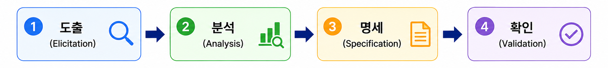

# 💻 04. 요구사항 분석

## 📖 요구사항 정의

### 📖 요구사항 ( Requirement )

#### 정의

요구사항은 **소프트웨어가 어떤 문제를 해결하기 위해 제공해야 하는 서비스와 정상적으로 운영되기 위해 필요한 제약 조건을 나타내는 것**이다.

소프트웨어 개발 및 유지보수 과정에서 필요한 기준과 근거를 제공하며, 개발 참여자 간 원활한 의사소통을 지원한다.

#### ✨ 특징

- 개발하려는 소프트웨어의 전반적인 내용을 파악할 수 있다.
- 이해관계자 간 의사소통을 원활하게 한다.
- 요구사항을 기반으로 개발 목표와 계획을 수립할 수 있다.
- 요구사항이 명확하게 정의되어야 이후 개발 과정의 오류를 줄일 수 있다.

 

 

## 📋 요구사항의 유형

요구사항은 관점과 목적에 따라 기능 요구사항, 비기능 요구사항, 사용자 요구사항, 시스템 요구사항으로 구분한다.

 

### ⚙️ 기능 요구사항 ( Functional Requirement )

#### 📖 정의

시스템이 **무엇을 수행해야 하는지, 어떤 기능을 제공해야 하는지에 대한 요구사항**이다.

#### ✨ 특징

- 시스템의 입력과 출력에 대한 요구사항
- 데이터 저장 및 처리 기능에 대한 요구사항
- 시스템이 반드시 수행해야 하는 기능
- 사용자가 제공받기를 원하는 기능

 

### 🔒 비기능 요구사항 ( Non-Functional Requirement )

#### 📖 정의

시스템의 기능 외에 **성능, 품질, 보안, 제약 조건 등에 대한 요구사항**이다.

#### ✨ 종류

| 구분 | 내용 |
|---|---|
| 시스템 장비 구성 요구사항 | 하드웨어 및 시스템 환경 |
| 성능 요구사항 | 처리 속도, 응답 시간 |
| 인터페이스 요구사항 | 시스템 간 연계 방식 |
| 데이터 요구사항 | 데이터 관리 및 저장 |
| 테스트 요구사항 | 테스트 기준 및 방법 |
| 보안 요구사항 | 데이터 보호 및 접근 제어 |
| 품질 요구사항 | 신뢰성, 사용성, 유지보수성 |
| 제약 요구사항 | 기술적·환경적 제한 조건 |
| 프로젝트 관리 요구사항 | 일정, 비용, 관리 기준 |
| 프로젝트 지원 요구사항 | 교육 및 운영 지원 |

 

### 👤 사용자 요구사항 ( User Requirement )

#### 📖 정의

사용자 관점에서 바라본 **시스템이 제공해야 하는 요구사항**이다.

#### ✨ 특징

- 사용자가 이해하기 쉬운 자연어로 작성한다.
- 사용자의 요구와 목적 중심으로 표현한다.

 

### 🖥️ 시스템 요구사항 ( System Requirement )

#### 📖 정의

개발자 관점에서 바라본 **시스템 전체가 제공해야 하는 요구사항**이다.

#### ✨ 특징

- 기술적인 용어를 사용하여 작성한다.
- 사용자 요구사항보다 구체적이다.
- 소프트웨어 요구사항이라고도 한다.

 

 

## 🔍 요구사항 분석 ( Requirement Analysis )

### 📖 정의

요구사항 분석은 **사용자의 요구사항을 추출하고 분석하여 개발 대상과 해결 방법을 결정하는 과정**이다.

소프트웨어 개발의 실제적인 첫 단계이며, 사용자의 요구사항 중 명확하지 않거나 모호한 부분을 발견하고 이를 명확하게 정의하는 과정이다.

#### ✨ 특징

- 사용자의 요구사항을 이해하고 분석한다.
- 요구사항의 타당성을 조사한다.
- 비용과 일정에 대한 제약 조건을 설정한다.
- 분석 결과를 문서화하여 설계 단계의 기초 자료로 활용한다.
- 소프트웨어 분석가에 의해 수행된다.

 

### ⚠️ 요구사항 분석이 어려운 이유

요구사항 분석은 사용자와 개발자 간의 의사소통을 통해 이루어지기 때문에 정확한 요구사항을 정의하기 어렵다.

#### 주요 원인

- 개발자와 사용자 간의 지식과 표현 방식의 차이로 인해 상호 이해가 어렵다.
- 사용자의 요구사항이 모호하거나 불명확할 수 있다.
- 소프트웨어 개발 과정에서 요구사항이 지속적으로 변경될 수 있다.
- 사용자의 요구사항은 예외 상황이 많아 체계적으로 구조화하기 어렵다.

 

### 🏗️ 구조적 분석 기법 ( Structured Analysis )

#### 📖 정의

구조적 분석 기법은 **자료의 흐름과 처리를 중심으로 사용자의 요구사항을 분석하는 방법**이다.

#### ✨ 특징

- 도형 중심의 분석 도구와 절차를 이용하여 요구사항을 파악하고 문서화한다.
- 하향식 방법을 사용하여 시스템을 세분화한다.
- 분석 과정에서 중복을 제거할 수 있다.
- 시스템 분석의 품질을 향상시키고 명세서 작성에 활용된다.

> 💡 구조적 분석 도구 ( DFD, 자료사전 등 ) 는 별도 문서에서 정리한다.

 

 

## 🔄 요구사항 분석 단계 절차

요구사항 분석은 다음 과정으로 진행된다.

 

### 1. 요구사항 분류

요구사항의 유형과 특성을 분석하는 단계이다.

#### ✨ 특징

- 기능 요구사항과 비기능 요구사항을 구분한다.
- 요구사항이 소프트웨어에 미치는 영향을 파악한다.
- 생명주기 동안 변경 가능성을 확인한다.

 

### 2. 개념 모델링 생성 및 분석

현실 세계의 문제를 단순화하여 모델로 표현하는 단계이다.

#### 📖 모델 ( Model )

현실 세계의 상황을 단순화하여 표현한 것이다.

#### 📖 모델링 ( Modeling )

모델을 생성하는 과정이다.

#### ✨ 특징

- 객체 모델, 데이터 모델, 상태 모델 등 다양한 모델을 작성할 수 있다.
- 요구사항을 쉽게 이해하고 분석하기 위해 사용한다.

 

### 3. 요구사항 할당

요구사항을 만족시키기 위한 아키텍처 구성 요소를 식별하는 단계이다.

#### ✨ 특징

- 요구사항과 구성 요소 간 관계를 분석한다.
- 구성 요소 간 상호작용을 통해 추가 요구사항을 발견할 수 있다.

 

### 4. 요구사항 협상

이해관계자 간 충돌하는 요구사항을 조정하고 합의하는 단계이다.

#### ✨ 특징

- 요구사항의 우선순위를 결정한다.
- 상충되는 요구사항을 조정한다.
- 이해관계자 간 합의를 통해 최종 요구사항을 결정한다.

 

### 5. 정형 분석

정형화된 언어와 수학적 기호를 이용하여 요구사항을 표현하는 단계이다.

#### ✨ 특징

- 형식적으로 정의된 언어를 사용한다.
- 요구사항의 의미를 명확하게 표현할 수 있다.
- 요구사항 분석의 마지막 단계에서 수행된다.

 

 

## 🔄 요구사항 개발 프로세스

### 📖 정의

요구사항 개발 프로세스는 **개발 대상의 요구사항을 도출하고 분석한 후 명세화하고 확인하는 일련의 체계적인 활동**이다.

📷 **요구사항 개발 프로세스**

#### ✨ 특징

- 요구사항을 체계적으로 관리한다.
- 개발 과정에서 발생할 수 있는 오류를 줄인다.
- 요구사항 개발은 요구공학의 한 요소이다.

 

> 💡 요구사항 개발 프로세스 수행 전 개발 목적과 비용의 적정성을 판단하기 위해 **타당성 조사 ( Feasibility Study )**가 선행될 수 있다.

 

### 🧩 요구공학 ( Requirement Engineering, RE )

#### 📖 정의

요구공학은 **무엇을 개발해야 하는지 요구사항을 정의하고 분석 및 관리하는 프로세스를 연구하는 학문**이다.

 

 

## 📌 요구사항 도출 ( Requirement Elicitation )

### 📖 정의

요구사항 도출은 **시스템 사용자와 이해관계자가 의견을 교환하여 요구사항을 식별하고 수집하는 과정**이다.

#### ✨ 특징

- 소프트웨어가 해결해야 할 문제를 이해하는 첫 번째 단계이다.
- 개발자와 고객 간 관계가 형성된다.
- 주요 이해관계자를 식별한다.
- 효율적인 의사소통이 중요하다.
- 소프트웨어 생명주기 동안 반복적으로 수행된다.

#### 📌 주요 기법

- 청취
- 인터뷰
- 질문
- 관찰
- 설문 조사
- 브레인스토밍

 

 

## 📝 요구사항 명세 ( Requirement Specification )

### 📖 정의

요구사항 명세는 **분석된 요구사항을 바탕으로 모델을 작성하고 문서화하는 과정**이다.

#### ✨ 특징

- 기능 요구사항은 완전하고 명확하게 작성한다.
- 비기능 요구사항은 필요한 내용을 명확하게 작성한다.
- 사용자가 이해하기 쉽고 개발자가 설계하기 쉽게 작성한다.
- 요구사항 변경 시 추적이 가능해야 한다.
- 소단위 명세서를 활용할 수 있다.

 

### 📌 소단위 명세서

데이터 흐름도에 나타난 처리 항목을 **1~2페이지 정도의 분량으로 작성한 논리적 명세서**이다.

 

 

## ✅ 요구사항 확인 ( Requirement Validation )

### 📖 정의

요구사항 확인은 **요구사항 명세서가 정확하고 완전하게 작성되었는지 검토하는 과정**이다.

#### ✨ 특징

- 요구사항이 실제 사용자의 요구를 반영하는지 확인한다.
- 요구사항 간 충돌 여부를 검토한다.
- 명세서의 이해 가능성과 일관성을 검토한다.
- 누락된 기능이 없는지 확인한다.
- 이해관계자가 함께 검토한다.
- 요구사항 관리 도구를 이용하여 형상 관리를 수행할 수 있다.

> 💡 요구사항 검증을 통해 모든 문제를 발견할 수 있는 것은 아니다.

 

 

## 🛠️ 요구사항 관리 도구 ( Requirement Management Tool )

### 📖 정의

요구사항 관리 도구는 **요구사항을 기반으로 프로젝트 관리, 설계, 개발, 테스트 등의 활동을 지원하는 도구**이다.

요구사항의 변경 사항을 관리하고 추적하여 개발 과정에서 요구사항의 일관성과 품질을 유지할 수 있도록 한다.

 

### 🎯 필요성

요구사항 관리 도구는 요구사항 변경으로 발생하는 문제를 관리하기 위해 사용한다.

- **비용 편익 분석** : 요구사항 변경에 따른 비용과 효과를 분석한다.
- **변경 추적** : 요구사항 변경 이력을 추적하고 관리한다.
- **영향 평가** : 요구사항 변경이 다른 요소에 미치는 영향을 분석한다.

 

### ✨ 주요 기능

#### 📌 기본 기능

- **프로젝트 생성**
  - 프로젝트 유형과 기본 모듈 템플릿을 제공한다.
  - 생성한 프로젝트를 재사용할 수 있다.

- **요구사항 작성**
  - 요구사항별 고유 ID와 식별자를 사용하여 관리한다.

- **요구사항 불러오기 / 내보내기**
  - DOC, XLS, HTML 등 다양한 형식의 파일을 지원한다.

 

#### 📌 핵심 기능

- **요구사항 이력 관리**
  - 요구사항별 변경 이력을 관리한다.

- **요구사항 베이스라인**
  - 요구사항 확정 기준을 제공하고 변경 관리의 기준점 역할을 한다.

 

#### 📌 부가 기능

- **협업 환경**
  - 여러 사용자가 요구사항 산출물을 편집할 수 있도록 지원한다.

- **외부 인터페이스**
  - 형상관리 도구(SVN, Git)와 연동할 수 있다.

- **확장성**
  - API 등을 통해 다른 시스템과 연동할 수 있다.

 

 

## 📝 요구사항 분석 핵심 정리

| 구분 | 핵심 내용 |
|---|---|
| 요구사항 | 소프트웨어가 제공해야 하는 서비스와 제약 조건 |
| 요구사항 분석 | 사용자의 요구를 분석하고 해결 방법 결정 |
| 구조적 분석 | 자료 흐름과 처리를 중심으로 분석 |
| 요구사항 유형 | 기능, 비기능, 사용자, 시스템 요구사항 |
| 요구사항 개발 프로세스 | 도출 → 분석 → 명세 → 확인 |
| 요구사항 도출 | 이해관계자로부터 요구사항 수집 |
| 요구사항 명세 | 요구사항을 문서화 |
| 요구사항 확인 | 명세서의 정확성과 완전성 검토 |