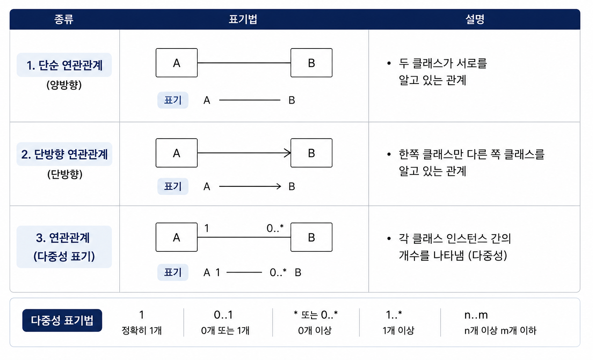
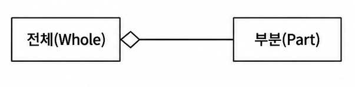
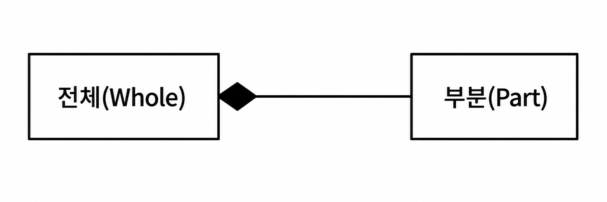
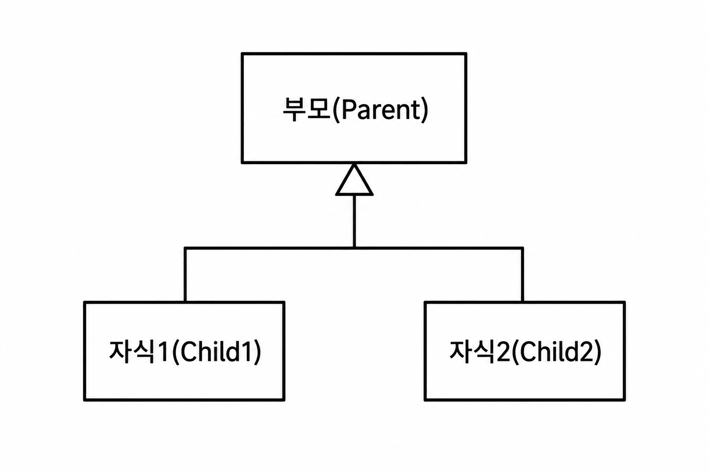
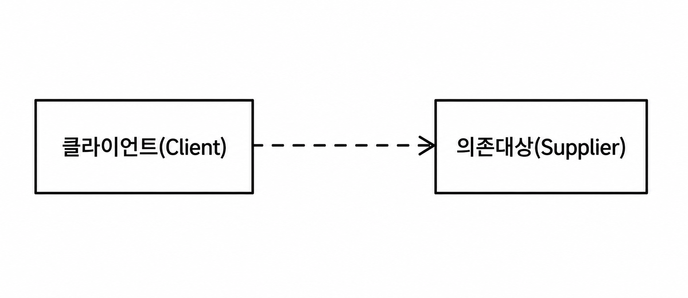
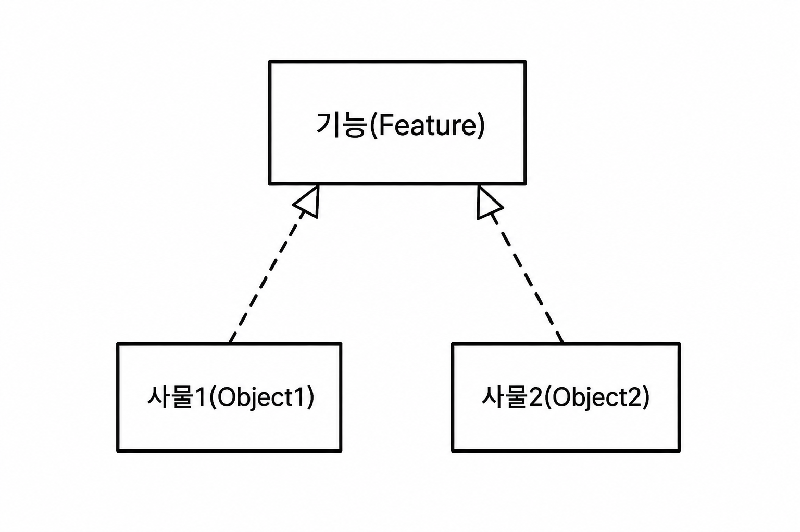
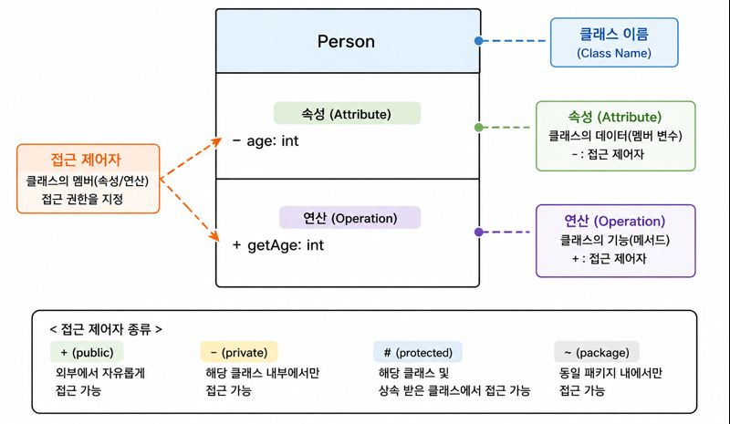
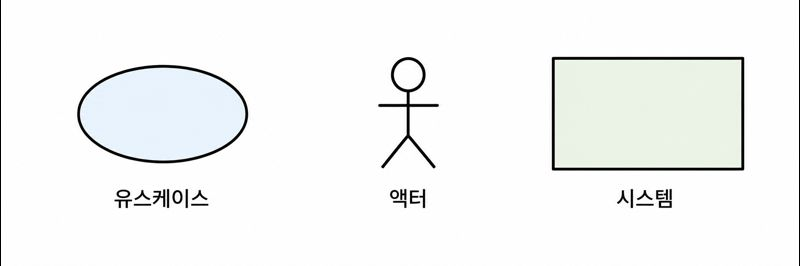

# 💻 06. UML

## 🧩 UML ( Unified Modeling Language )

### 📖 정의

UML은 **객체지향 시스템을 분석, 설계, 구현하는 과정에서 시스템을 표준화된 방법으로 표현하기 위한 범용 모델링 언어**이다.

시스템 개발자와 사용자, 개발자 간의 의사소통을 원활하게 하고, 시스템을 명세화·시각화·문서화하는 데 사용된다.

#### ✨ 특징

- Rumbaugh, Booch, Jacobson의 객체지향 방법론을 통합하여 만들어졌다.
- OMG ( Object Management Group ) 에서 국제 표준으로 채택하였다.
- 객체지향 시스템의 구조와 동작을 시각적으로 표현한다.
- 구조 다이어그램 ( 6개 ) 과 행위 다이어그램 ( 7개 ) 으로 구성된다.

 

### 🎯 UML 특징

> 📝 암기 : ***가구명문***

| 특징 | 설명 |
|---|---|
| 가시화 언어 ( Visualizing ) | 시스템을 그림으로 표현하여 이해와 의사소통을 돕는다. |
| 구축 언어 ( Constructing ) | 다양한 프로그래밍 언어로 구현 가능하며 코드 생성 및 역공학을 지원한다. |
| 명세화 언어 ( Specifying ) | 시스템의 구조와 기능을 정확하게 명세한다. |
| 문서화 언어 ( Documenting ) | 개발 과정과 결과를 문서로 기록하고 관리한다. |

 

## 🧩 UML 구성 요소

> 📝 암기 : ***사관다***

UML은 **사물(Thing), 관계(Relationship), 다이어그램(Diagram)** 으로 구성된다.

| 구성 요소 | 설명 |
|---|---|
| 사물 ( Thing ) | 모델을 구성하는 기본 요소 |
| 관계 ( Relationship ) | 사물과 사물 사이의 연결 관계 |
| 다이어그램 ( Diagram ) | 사물과 관계를 목적에 맞게 시각적으로 표현한 그림 |

 

## 📦 UML 사물 ( Thing )

> 📝 암기 : ***구행그주***

사물은 **UML 모델을 구성하는 기본 요소**이다.

| 종류 | 설명 | 예 |
|---|---|---|
| 구조 사물 ( Structural Thing ) | 시스템의 정적인 요소를 표현 | 클래스, 유스케이스, 컴포넌트, 노드 |
| 행동 사물 ( Behavioral Thing ) | 시스템의 동적인 행위를 표현 | 상호작용, 상태 머신 |
| 그룹 사물 ( Grouping Thing ) | 요소들을 그룹으로 묶어 관리 | 패키지 |
| 주해 사물 ( Annotational Thing ) | 모델에 설명이나 제약사항을 추가 | 노트 ( Note ) |

  

  

## 🔗 UML 관계 ( Relationship )

사물과 사물 사이의 관계를 표현한다.

 

### 1️⃣ 연관 관계 (Association )

두 개 이상의 사물이 서로 관련되어 있음을 표현하는 관계이다.

#### ✨ 특징

- 실선으로 표현한다.
- 방향성이 있으면 화살표를 사용한다.
- 양방향 관계는 화살표를 생략한다.
- 다중도 ( Multiplicity )를 함께 표시할 수 있다.

 

### 2️⃣ 집합 관계 ( Aggregation )

전체와 부분의 관계를 표현하는 관계이다.

#### ✨ 특징

- 부분 객체는 독립적으로 존재할 수 있다.
- 속이 빈 마름모 ( ◇ ) 로 표현한다.

 

### 3️⃣ 포함 관계 ( Composition )

집합 관계보다 강한 포함 관계를 표현한다.

#### ✨ 특징

- 전체 객체가 소멸하면 부분 객체도 함께 소멸한다.
- 생명주기를 공유한다.
- 속이 채워진 마름모 ( ◆ ) 로 표현한다.

 

### 4️⃣ 일반화 관계 ( Generalization )

상속 관계를 표현하는 관계이다.

#### ✨ 특징

- 일반적인 클래스와 구체적인 클래스의 관계를 표현한다.
- 하위 클래스에서 상위 클래스로 속이 빈 삼각형 화살표를 사용한다.

 

### 5️⃣ 의존 관계 ( Dependency )

필요한 순간에만 영향을 주는 관계이다.

#### ✨ 특징

- 일시적인 사용 관계를 표현한다.
- 한 클래스가 다른 클래스를 매개변수나 지역 변수로 사용하는 경우가 많다.
- 점선 화살표로 표현한다.

 

### 6️⃣ 실체화 관계 ( Realization )

인터페이스와 이를 구현하는 클래스 사이의 관계를 표현한다.

#### ✨ 특징

- 인터페이스에서 정의한 기능을 클래스가 구현한다.
- 속이 빈 삼각형의 점선 화살표로 표현한다.

  

  

## 🖼️ UML 다이어그램 ( Diagram )

### 📖 정의

UML 다이어그램은 **사물 ( Thing ) 과 관계 ( Relationship ) 를 도형으로 표현하여 시스템을 시각화한 것**이다.

시스템을 다양한 관점에서 표현하여 개발자와 사용자 간의 의사소통을 돕는다.

 

### 📊 UML 다이어그램 구분

UML 다이어그램은 **구조 다이어그램 ( Structure Diagram ) ** 과 **행위 다이어그램 ( Behavior Diagram )** 으로 구분된다.

| 구분 | 설명 |
|---|---|
| 구조 다이어그램 | 시스템의 정적인 구조를 표현 |
| 행위 다이어그램 | 시스템의 동적인 동작과 상호작용을 표현 |

 

### 🏗️ 구조 다이어그램 ( Structure Diagram )

> 📝 암기 : ***클객 컴배 복패***

시스템의 **정적인 구조와 구성 요소 간의 관계**를 표현한다.

| 다이어그램 | 설명 |
|---|---|
| 클래스 다이어그램 ( Class Diagram ) | 클래스의 속성, 연산 및 클래스 간 관계를 표현 |
| 객체 다이어그램 ( Object Diagram ) | 특정 시점의 객체(인스턴스)와 객체 간 관계를 표현 |
| 컴포넌트 다이어그램 ( Component Diagram ) | 컴포넌트 간의 구조와 인터페이스를 표현 |
| 배치 다이어그램 ( Deployment Diagram ) | 하드웨어 노드와 소프트웨어의 물리적 배치를 표현 |
| 복합체 구조 다이어그램 ( Composite Structure Diagram ) | 클래스나 컴포넌트 내부 구조를 표현 |
| 패키지 다이어그램 ( Package Diagram ) | 패키지와 패키지 간의 의존 관계를 표현 |

 

### ⚙️ 행위 다이어그램 ( Behavior Diagram )

> 📝 암기 : ***유시커 상활타***

시스템의 **동작과 객체 간 상호작용**을 표현한다.

| 다이어그램 | 설명 |
|---|---|
| 유스케이스 다이어그램 ( Use Case Diagram ) | 사용자의 요구사항과 시스템 기능을 표현 |
| 시퀀스 다이어그램 ( Sequence Diagram ) | 객체 간 메시지 흐름을 시간 순서대로 표현 |
| 커뮤니케이션 다이어그램 ( Communication Diagram ) | 객체 간 상호작용과 연관 관계를 표현 |
| 상태 다이어그램 ( State Diagram ) | 객체의 상태 변화와 상태 전이를 표현 |
| 활동 다이어그램 ( Activity Diagram ) | 업무 처리 절차와 작업 흐름을 표현 |
| 타이밍 다이어그램 ( Timing Diagram ) | 객체의 상태 변화와 시간 제약을 표현 |
| 상호작용 개요 다이어그램 ( Interaction Overview Diagram ) | 여러 상호작용 다이어그램의 제어 흐름을 표현 |

  

  

## 🧩 주요 UML 다이어그램

 

### 🏗️ 클래스 다이어그램 ( Class Diagram )

> **구조적 ( 정적 ) 다이어그램**

#### 📖 정의

클래스 다이어그램은 **시스템을 구성하는 클래스의 속성, 연산 ( 메서드 ), 클래스 간의 정적인 관계를 표현하는 다이어그램**이다.

객체지향 모델링에서 가장 많이 사용되는 다이어그램으로, 시스템의 구조를 분석하고 설계하는 데 활용된다.

#### ✨ 특징

- 클래스 간의 관계를 표현한다.
- 클래스의 속성과 연산을 표현한다.
- 시스템의 정적인 구조를 표현한다.
- 시스템 구성 요소를 문서화하는 데 사용된다.
- 객체지향 설계 및 구현의 기반이 된다.

 

#### 🧩 클래스 다이어그램 구성 요소

##### 📌 제약 조건 ( Constraint )

속성이나 연산에 적용되는 조건을 표현한다.

 

##### 📌 관계 ( Relationship )

클래스 간의 관계를 표현한다.

- 연관(Association)
- 집합(Aggregation)
- 포함(Composition)
- 일반화(Generalization)
- 의존(Dependency)
- 실체화(Realization)

 

##### 📌 클래스 ( Class )

객체의 공통된 속성과 연산을 정의한 설계도이다.

클래스는 일반적으로 다음과 같은 3개의 영역으로 구성된다.

- 클래스 이름 ( Name )
- 속성 ( Attribute )
- 연산 ( Operation )

 

##### 🧩 클래스의 구성 요소

 

###### 📌 클래스 이름 ( Name )

클래스를 식별하기 위한 이름이다.

 

###### 📌 속성 ( Attribute )

클래스가 가지는 상태(State)나 데이터를 표현한다.

 

###### 📌 연산 ( Operation )

클래스가 수행할 수 있는 기능(메서드)을 표현한다.

 

###### 📌 접근 제어자 ( Access Modifier )

클래스의 속성과 연산에 대한 접근 범위를 나타낸다.

| 기호 | 의미 |
|---|---|
| + | Public |
| - | Private |
| # | Protected |
| ~ | Package(Default) |

  

### 👤 유스케이스 다이어그램 ( Use Case Diagram )

> **행위적 ( 동적 ) 다이어그램**

#### 📖 정의

유스케이스 다이어그램은 **사용자의 관점에서 시스템이 제공하는 기능과 외부 요소 ( 액터 ) 간의 상호작용을 표현하는 다이어그램**이다.

요구사항 분석 단계에서 시스템의 기능을 정의할 때 사용된다.

#### ✨ 특징

- 사용자 관점에서 시스템 기능을 표현한다.
- 요구사항 분석에 활용된다.
- 시스템의 범위를 파악할 수 있다.
- 외부 요소와 시스템의 상호작용을 표현한다.

 

#### 🧩 유스케이스 다이어그램 구성 요소

##### 📌 유스케이스 ( Use Case )

시스템이 사용자에게 제공하는 기능 또는 서비스를 의미한다.

 

##### 📌 액터 ( Actor )

시스템과 상호작용하는 외부 요소이다.

- 사람
- 외부 시스템
- 조직

액터는 역할(Role) 중심으로 정의한다.

 

##### 📌 시스템 ( System )

유스케이스들을 하나의 사각형으로 묶어 시스템의 범위를 나타낸다.

 

#### 🔗 유스케이스 관계

##### 📌 연관 관계 ( Association )

액터와 유스케이스 간의 상호작용을 표현한다.

- **실선**으로 연결한다.

> 📷 연관 관계 그림 삽입

 

##### 📌 포함 관계 ( Include )

하나의 유스케이스가 다른 유스케이스를 **항상 포함하여 실행**하는 관계이다.

- **점선 화살표**
- `<<include>>`

> 📷 Include 그림 삽입

 

##### 📌 확장 관계 ( Extend )

특정 조건에서만 추가 기능이 수행되는 관계이다.

- **점선 화살표**
- `<<extend>>`

> 📷 Extend 그림 삽입

 

##### 📌 일반화 관계 ( Generalization )

공통 기능을 추상화하여 부모-자식 관계를 표현한다.

- **속이 빈 실선 화살표**

> 📷 일반화 관계 그림 삽입

---

### 💬 시퀀스 다이어그램 ( Sequence Diagram )

> **행위적(동적) 다이어그램**

#### 📖 정의

시퀀스 다이어그램은 **객체 간의 상호작용을 시간의 흐름에 따라 메시지 교환 형태로 표현하는 다이어그램**이다.

#### ✨ 특징

- 객체 간 메시지 흐름을 표현한다.
- 시간 순서에 따른 객체의 상호작용을 표현한다.
- 객체의 생명주기를 표현한다.

 

#### 🧩 시퀀스 다이어그램 구성 요소

##### 📌 객체 ( Object )

메시지를 주고받는 대상이다.

> 📷 객체 그림 삽입

 

##### 📌 생명선 ( Lifeline )

객체가 존재하는 기간을 나타낸다.

- 객체 아래의 점선으로 표현한다.

> 📷 생명선 그림 삽입

 

##### 📌 실행 상자 ( Activation )

객체가 실제 작업을 수행하는 시간을 나타낸다.

> 📷 실행 상자 그림 삽입

 

##### 📌 메시지 ( Message )

객체 간 호출 및 데이터 전달을 표현한다.

> 📷 메시지 그림 삽입

 

##### 📌 반환 메시지 ( Return Message )

작업 수행 결과를 호출한 객체로 반환하는 메시지이다.

> 📷 반환 메시지 그림 삽입

 

##### 📌 액터 ( Actor )

시스템에 서비스를 요청하는 외부 요소이다.

 

##### 📌 제어 블록 ( Combined Fragment )

반복(Loop), 조건(Alt), 선택(Opt) 등의 제어 구조를 표현한다.

---

### 🔄 상태 다이어그램 ( State Diagram )

> **행위적(동적) 다이어그램**

#### 📖 정의

상태 다이어그램은 **객체의 상태 변화와 상태 간의 전이를 표현하는 다이어그램**이다.

이벤트 발생에 따라 객체의 상태가 어떻게 변화하는지를 나타낸다.

#### ✨ 특징

- 객체의 생명주기를 표현한다.
- 이벤트에 따른 상태 변화를 표현한다.
- 상태 전이를 중심으로 동작을 분석한다.
- 럼바우(Rumbaugh)의 동적 모델링에 활용된다.

 

#### 🧩 상태 다이어그램 구성 요소

##### 📌 상태 ( State )

객체가 특정 시점에 존재하는 상태이다.

 

##### 📌 시작 상태 ( Initial State )

객체가 시작되는 상태이다.

- ● (채워진 원)

 

##### 📌 종료 상태 ( Final State )

객체의 동작이 종료되는 상태이다.

- ◎ (이중 원)

 

##### 📌 전이 ( Transition )

한 상태에서 다른 상태로 이동하는 것을 의미한다.

- 화살표로 표현한다.

 

##### 📌 이벤트 ( Event )

상태 변화를 발생시키는 사건이다.

 

##### 📌 액션(Action)

상태가 변경될 때 수행되는 작업을 의미한다.

> 📷 상태 다이어그램 예시 삽입

# 📝 UML 핵심 정리

| 구분 | 핵심 내용 |
|---|---|
| UML | 객체지향 시스템을 표현하기 위한 표준 모델링 언어 |
| UML 특징 | 가시화, 구축, 명세화, 문서화 (가구명문) |
| UML 구성 요소 | 사물, 관계, 다이어그램 (사관다) |
| UML 사물 | 구조, 행동, 그룹, 주해 (구행그주) |
| UML 관계 | 연관, 집합, 포함, 일반화, 의존, 실체화 |
| 구조 다이어그램 | 시스템의 정적인 구조 표현 (클객컴배복패) |
| 행위 다이어그램 | 시스템의 동적인 동작 표현 (유시커상활타상) |
| 클래스 다이어그램 | 클래스의 속성, 연산, 관계를 표현 |
| 유스케이스 다이어그램 | 사용자 관점에서 시스템의 기능을 표현 |
| 시퀀스 다이어그램 | 객체 간 메시지 흐름을 시간 순서대로 표현 |
| 상태 다이어그램 | 객체의 상태 변화와 상태 전이를 표현 |