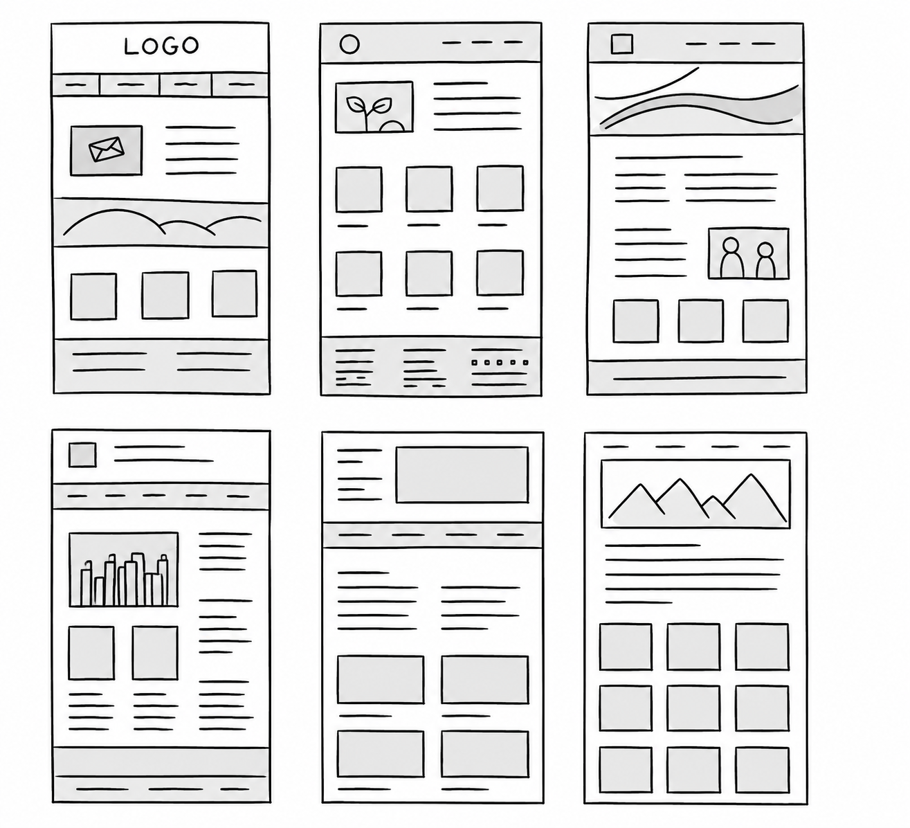
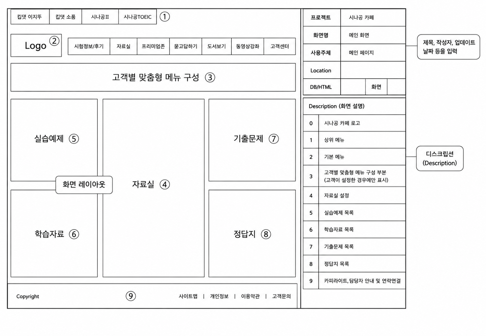
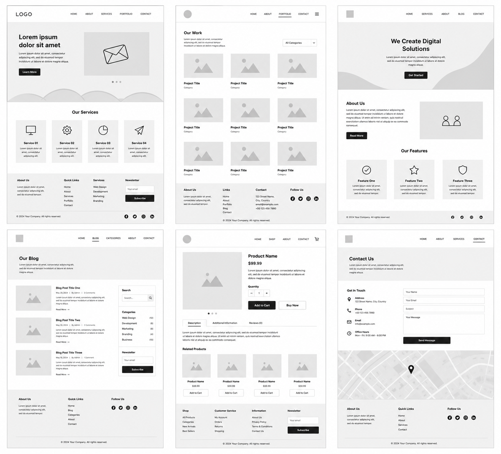
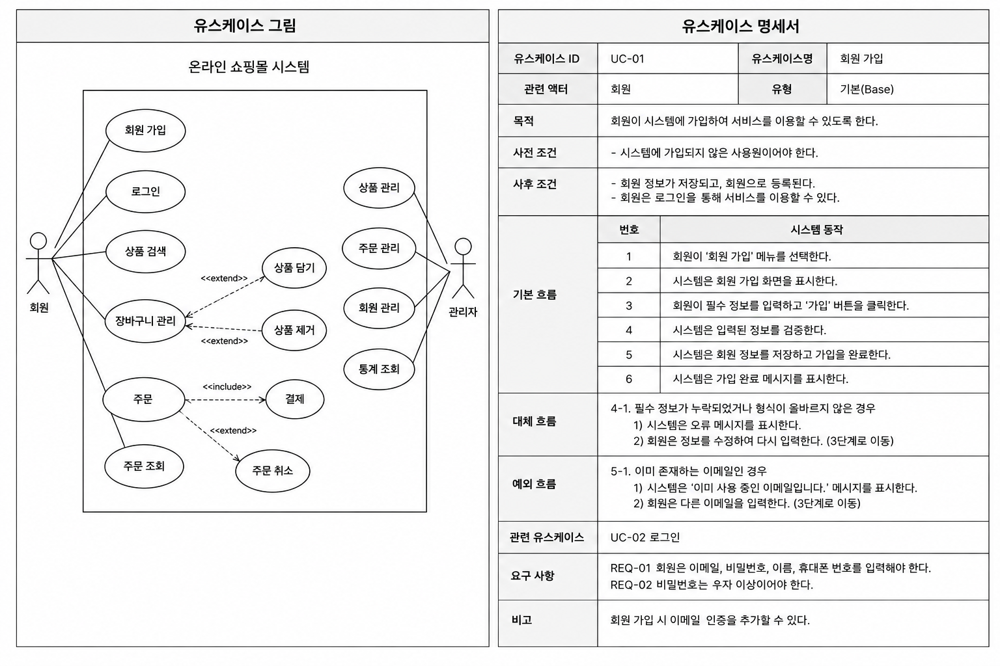

# 💻 02. UI 설계 도구

## 📖 UI 설계 도구

### 📖 정의

UI 설계 도구는 **사용자의 요구사항을 바탕으로 화면 구조와 화면 흐름을 설계하고 표현하기 위한 도구**이다.

실제 시스템을 구현하기 전에 화면 구성, 기능, 사용자 흐름 등을 미리 설계하여 이해관계자 간의 의사소통과 요구사항 검증에 활용된다.

#### ✨ 특징

- 화면 구성을 시각적으로 표현한다.
- 개발 전에 요구사항을 검토하고 수정할 수 있다.
- 사용자와 개발자 간 의사소통을 지원한다.
- 설계 단계에서 오류를 줄이고 개발 효율을 높인다.

 

 

## 🛠️ UI 설계 도구의 종류

> 📝 암기 : **와스프목**

UI 설계 과정에서는 와이어프레임, 목업, 스토리보드, 프로토타입 등을 활용하여 화면 구조와 기능을 점진적으로 구체화하며, 유스케이스는 사용자의 기능 요구사항을 정의하는 데 활용된다.

 

### 📝 와이어프레임 ( Wireframe )

#### 📖 정의

와이어프레임은 **화면의 기본 구조와 레이아웃을 단순하게 표현한 설계도**이다.

#### ✨ 특징

- 기획 초기 단계에서 작성한다.
- 화면의 전체 구조와 UI 요소의 배치를 표현한다.
- 세부 디자인은 포함하지 않는다.
- 이해관계자와 화면 구성을 협의하기 위해 사용한다.

> 💡 화면의 '뼈대'를 설계하는 단계이다.

 

### 📚 스토리보드 ( Storyboard )

#### 📖 정의

스토리보드는 **와이어프레임에 화면 설명, 기능, 화면 이동 흐름 등을 추가하여 작성한 설계 문서**이다.

#### ✨ 특징

- 화면 구성과 기능을 함께 정의한다.
- 페이지 간 이동 흐름을 표현한다.
- 개발자와 디자이너가 참고하는 설계 문서이다.
- 화면 설명, 처리 로직, 예외 처리 등을 포함할 수 있다.

> 💡 화면과 기능을 함께 설명하는 문서이다.

 

### ⚙️ 프로토타입 ( Prototype )

#### 📖 정의

프로토타입은 **와이어프레임이나 스토리보드에 인터랙션을 적용하여 실제처럼 동작하도록 만든 동적인 모형**이다.

#### ✨ 특징

- 실제 구현과 유사하게 동작한다.
- 사용자와 이해관계자의 피드백을 수집하는 데 활용된다.
- 사용자 테스트와 사용성 평가에 활용된다.
- 서비스 흐름을 미리 검증할 수 있다.
- 페이퍼 프로토타입과 디지털 프로토타입으로 구분된다.

> 💡 동작까지 확인할 수 있는 테스트용 모델이다.

 

### 🎨 목업 ( Mockup )

#### 📖 정의

목업은 **실제 화면과 유사하게 디자인한 정적인 형태의 화면 모형**이다.

#### ✨ 특징

- 화면의 디자인과 배치를 확인할 수 있다.
- 실제 기능은 동작하지 않는다.
- 시각적인 디자인과 화면 구성을 검토하는 데 사용한다.
- 디자인 검토와 사용자 평가에 활용된다.

> 💡 와이어프레임보다 완성도가 높은 시각적 결과물이다.

 

### 👤 유스케이스 ( Use Case )

#### 📖 정의

유스케이스는 **사용자의 관점에서 시스템이 제공해야 하는 기능과 요구사항을 표현한 모델**이다.

#### ✨ 특징

- 사용자 요구사항을 기능 중심으로 표현한다.
- 요구사항 분석 단계에서 작성한다.
- 시스템의 기능 범위를 정의하는 데 활용된다.
- 일반적으로 유스케이스 다이어그램으로 표현한다.

> 💡 UML의 유스케이스 다이어그램과 연결되는 개념이다.

 

 

## 📝 UI 설계 도구 핵심 정리

| 설계 도구 | 핵심 내용 |
|---|---|
| 와이어프레임 | 화면의 기본 구조와 레이아웃 설계 |
| 목업 | 실제 화면과 유사한 정적 디자인 |
| 스토리보드 | 화면 설명과 기능, 흐름을 포함한 설계 문서 |
| 프로토타입 | 실제처럼 동작하는 동적 모형 |
| 유스케이스 | 사용자 관점의 기능 요구사항 표현 |