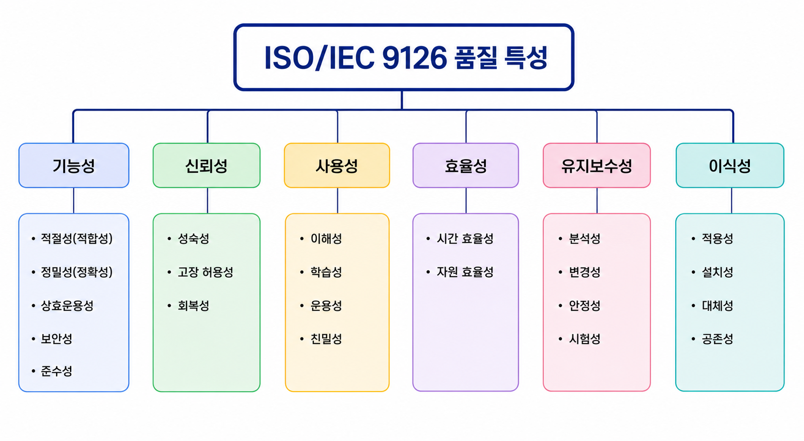
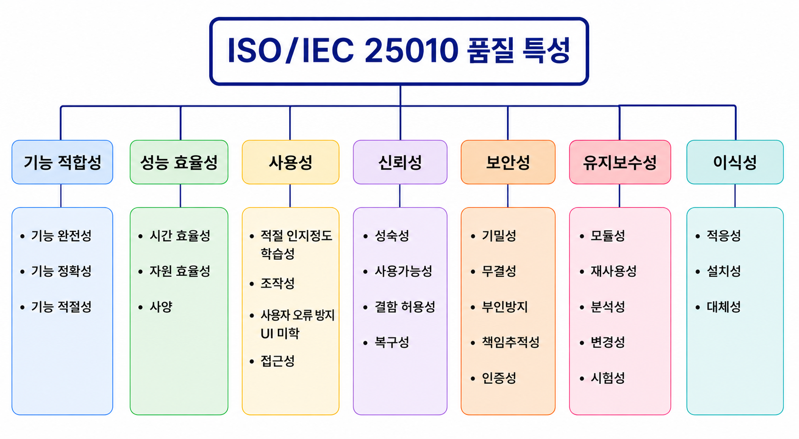

# 💻 03. 품질 요구사항

## 📖 품질 요구사항

### 📖 정의

품질 요구사항은 **소프트웨어가 사용자와 이해관계자의 요구를 만족하기 위해 갖추어야 할 품질 특성에 대한 요구사항**이다.

기능뿐만 아니라 성능, 신뢰성, 사용성, 유지 보수성 등 소프트웨어의 품질을 결정하는 요소를 정의한다.

#### ✨ 특징

- 기능 요구사항 외의 품질 기준을 정의한다.
- 소프트웨어의 성능과 안정성을 확보한다.
- 사용자 만족도 향상에 중요한 요소이다.
- 국제 표준을 기준으로 품질을 평가할 수 있다.

> 💡 품질 요구사항은 비기능 요구사항(Non-Functional Requirement)의 대표적인 요소이다.

 

 

## 📚 소프트웨어 품질 표준

### 📖 ISO/IEC 9126

ISO/IEC 9126은 **소프트웨어 품질 특성과 평가를 위한 국제 표준**이다.

소프트웨어의 품질을 6가지 특성과 여러 하위 특성으로 구분하여 평가하도록 정의하였다.

#### ✨ 특징

- 소프트웨어 품질 평가의 대표적인 국제 표준
- 개발 및 평가 기준으로 활용
- 2011년 ISO/IEC 25010으로 개정

 

### 📖 ISO/IEC 25010

ISO/IEC 25010은 **ISO/IEC 9126을 개정한 소프트웨어 품질 모델 국제 표준**이다.

기존 품질 특성을 보완하여 **보안성(Security)**과 **호환성(Compatibility)**을 강화하였다.

ISO/IEC 25010은 기능적합성, 성능효율성, 호환성, 사용성, 신뢰성, 보안성, 유지 보수성, 이식성의 8가지 품질 특성을 정의한다.

#### ✨ 특징

- 2011년 제정
- ISO/IEC 9126 개선 버전
- 최신 국제 품질 표준

 

### 📖 기타 품질 관련 표준

| 표준 | 설명 |
|---|---|
| ISO/IEC 12119 | 패키지 소프트웨어 품질 요구사항 및 테스트 규정 |
| ISO/IEC 14598 | 소프트웨어 품질 측정 및 평가 절차 규정 |

 

 

## 🏆 ISO/IEC 9126 품질 특성

> 📝 암기 : ***기신사효유이***
> **기**능성 ( Functionality )
> **신**뢰성 ( Reliability )
> **사**용성 ( Usability )
> **효**율성 ( Efficiency )
> **유**지 보수성 ( Maintainability )
> **이**식성 ( Portability )

ISO/IEC 9126에서는 소프트웨어 품질을 **6가지 특성**으로 구분한다.

 

### ⚙️ 기능성 ( Functionality )

#### 📖 정의

사용자의 요구사항을 만족하는 기능을 정확하게 제공하는 능력이다.

#### ✨ 하위 특성

- 적절성(적합성)
- 정밀성(정확성)
- 상호운용성
- 보안성
- 준수성

 

### 🛡️ 신뢰성 ( Reliability )

#### 📖 정의

정해진 조건에서 오류 없이 안정적으로 기능을 수행하는 능력이다.

#### ✨ 하위 특성

- 성숙성
- 고장 허용성
- 회복성

 

### 👤 사용성 ( Usability )

#### 📖 정의

사용자가 쉽고 편리하게 배우고 사용할 수 있는 정도이다.

#### ✨ 하위 특성

- 이해성
- 학습성
- 운용성
- 친밀성

 

### ⚡ 효율성 ( Efficiency )

#### 📖 정의

제한된 자원으로 요구되는 성능을 얼마나 효율적으로 제공하는지에 대한 정도이다.

#### ✨ 하위 특성

- 시간 효율성
- 자원 효율성

 

### 🔧 유지 보수성 ( Maintainability )

#### 📖 정의

환경 변화나 새로운 요구사항에 맞게 소프트웨어를 쉽게 수정하고 확장할 수 있는 능력이다.

#### ✨ 하위 특성

- 분석성
- 변경성
- 안정성
- 시험성

 

### 🌎 이식성 ( Portability )

#### 📖 정의

다른 운영 환경에서도 쉽게 설치하고 사용할 수 있는 능력이다.

#### ✨ 하위 특성

- 적용성
- 설치성
- 대체성
- 공존성

 

 

## 📝 품질 요구사항 핵심 정리

| 구분 | 핵심 내용 |
|---|---|
| 품질 요구사항 | 소프트웨어가 갖추어야 할 품질 기준 |
| ISO/IEC 9126 | 소프트웨어 품질 특성 국제 표준 |
| ISO/IEC 25010 | ISO/IEC 9126을 개선한 최신 품질 표준 |
| 기능성 | 요구 기능을 정확하게 수행 |
| 신뢰성 | 안정적으로 오류 없이 수행 |
| 사용성 | 배우기 쉽고 사용하기 쉬움 |
| 효율성 | 적은 자원으로 높은 성능 제공 |
| 유지 보수성 | 수정과 확장이 쉬움 |
| 이식성 | 다른 환경에서도 쉽게 사용 가능 |